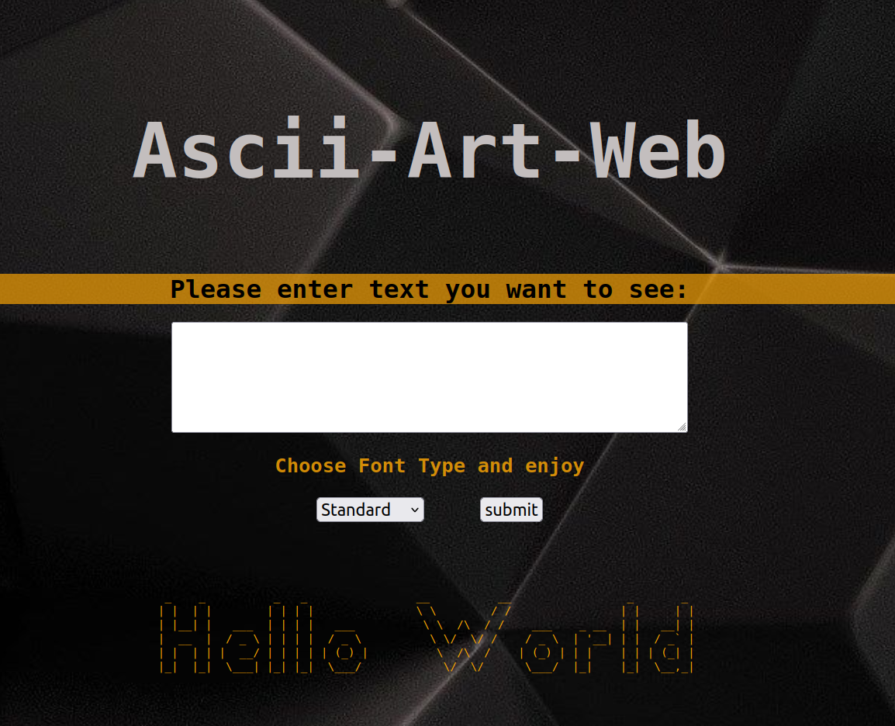

## Description

This small project is aimed to draw ascii-art in the web page with several fontTypes.

## Usage: how to run?
Clone this repository to your local machine. `cd ascii-art-web` and type `go run ./cmd/`  
After you can go to the browser and enter this link: `localhost:8080`.  
Then you need to enter text and choose fontype and press to submit button.

## Implementation

Script based on ascii-art terminal version and implemented for browser usage.  
It uses `maps` for drawing ascii-art, which it gets from txt file that contains ascii symbol's drawing versions.
